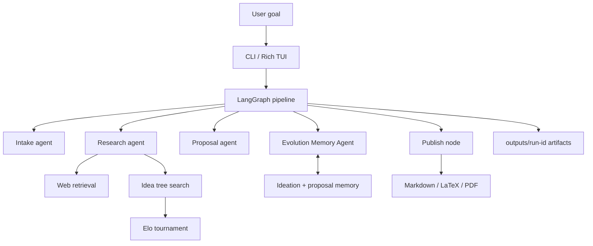
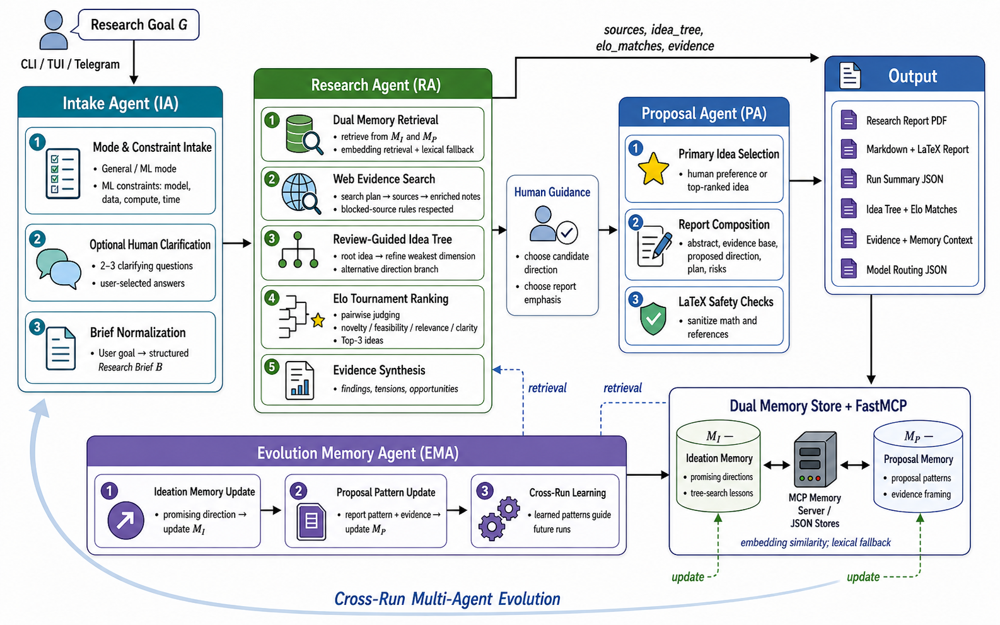

# EvoResearcher

EvoResearcher is an interactive deep-research proposal system. It uses LangGraph, DeepSeek models, web retrieval, dual JSON memory, tree-search ideation, Elo ranking, and Markdown/LaTeX/PDF report generation.

## System Structure





Key modules:

- `evoresearcher/main.py`: CLI entrypoint and graph wiring.
- `evoresearcher/orchestration/graph.py`: LangGraph nodes and edges.
- `evoresearcher/agents/`: intake, research, proposal, and memory agents.
- `evoresearcher/research/`: idea tree search and Elo ranking.
- `evoresearcher/retrieval/`: web source retrieval.
- `evoresearcher/report/`: Markdown, LaTeX, and PDF output.
- `benchmarks/drb2/`: DeepResearch-Bench-II evaluation harness.

## Setup

Requires Python 3.11+.

```bash
python -m venv .venv
source .venv/bin/activate
pip install -e '.[dev]'
```

Create `.env`:

```bash
cp .env.example .env
```

Set:

```bash
DEEPSEEK_API_KEY=...
DEEPSEEK_MODEL=deepseek-chat
DEEPSEEK_BASE_URL=https://api.deepseek.com/chat/completions
```

`tectonic` is optional. If installed, EvoResearcher also renders PDF reports; Markdown is always written.

## How to Run

Interactive:

```bash
evoresearcher --mode general
```

Non-interactive:

```bash
evoresearcher --mode general --goal "Investigate why social protection programs in South Asia often fail the ultra-poor."
```

ML mode:

```bash
evoresearcher --mode ml --goal "Design a robust benchmark for long-context retrieval agents."
```

Useful options:

- `--tree-depth INT`: idea-tree depth, default `2`.
- `--branching-factor INT`: children kept per expansion, default `2`.
- `--max-sources INT`: retrieval budget, default `6`.
- `--no-search`: disable web retrieval.
- `--blind-expansion`: ablation without review-guided tree expansion.
- `--no-elo`: ablation without Elo ranking.
- `--workspace-dir PATH`: alternate output and memory root.
- `--print-json`: print final graph state.

Outputs are written to `outputs/<run-id>/`, including `research_report.md`, `research_report.tex`, `research_report.pdf`, `top_ideas.json`, `idea_tree.json`, `elo_matches.json`, `sources.json`, and `run_summary.json`.

## Example Usage

General research:

```bash
evoresearcher --mode general --goal "Map the main causes of urban heat inequality and propose interventions."
```

ML research:

```bash
evoresearcher --mode ml --goal "Propose a method for evaluating hallucination in multimodal assistants."
```

Run without web retrieval:

```bash
evoresearcher --mode general --no-search --goal "Generate research directions for memory-augmented agents."
```

Run an ablation:

```bash
evoresearcher --mode general --blind-expansion --no-elo --goal "Compare retrieval strategies for deep research agents."
```

Run tests:

```bash
pytest
```

Run the DRB-II benchmark harness:

```bash
bash benchmarks/drb2/run_all.sh
```

Benchmark summaries are in `benchmarks/drb2/results/FINDINGS.md`.
