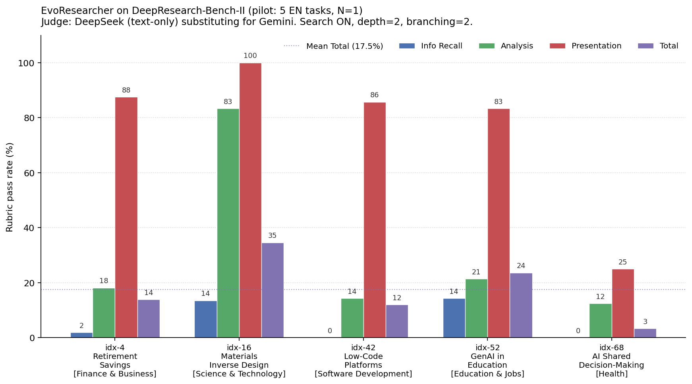

# Pilot results — what the chart actually means

This is a personal explainer. Not the final report.

## What benchmark are we even running

**DeepResearch-Bench-II (DRB-II)** is a benchmark for "deep research agents" —
systems that take a research question and produce a written report. The
benchmark was built by USTC-CMI: they took 132 real research prompts (in
finance, science, software, health, etc.), had domain experts write what an
ideal report on each prompt would look like, and then **decomposed each
expert report into hundreds of binary "rubric items"** — atomic facts or
structural requirements.

For example, the rubrics for a Finance task ask things like:

- *"Explicitly state that Pakistan's Benazir Income Support Programme failed
  to cover 79% of the poorest quintile of the target population."*
- *"Database list provides the correct URL for Open Quantum Materials
  Database: <https://www.oqmd.org/>"*
- *"The report strictly follows the task requirements, divided into three
  independent sections: …"*

Then they run a system on each prompt, get its report, and check how many
of those rubrics the report satisfies. The headline number is
**rubric pass rate** — what fraction of the rubric items the report got
right.

## How a single rubric is scored

Every rubric item gets one of three scores from the judge LLM:

- **1** — the report clearly satisfies the rubric, *and* the supporting
  sentence(s) don't cite any reference on a "blocked" list (which exists to
  prevent the system from cheating by quoting the expert's own source).
- **0** — the report doesn't mention the rubric item at all.
- **-1** — the report does mention it, but the supporting evidence cites a
  blocked reference (so it's penalised as effectively a copy).

In our charts and CSVs, "pass rate" = `count(score == 1) / total rubrics`
within whatever bucket we're aggregating (a single dimension, a single task,
or everything).

## What the four columns actually mean

DRB-II splits its rubrics into three **dimensions**, plus an overall total.

### Info Recall (the blue bar)

The "did your report contain the specific facts an expert would mention"
dimension. This is **the largest bucket** — typically 50–70% of the rubrics
on any given task. It's full of very specific factual asks: named programs,
exact percentages, specific URLs, particular institutions. It's also the
dimension where the published DRB-II paper says even the strongest commercial
systems struggle (most score under 50%).

This is where our pilot is weakest: **5.9% mean across the 5 tasks, two
tasks at literal 0%**. The reason is structural — EvoResearcher pulls only
6 sources from DuckDuckGo HTML scraping, scrapes ~1.6 KB per page, and writes
a 3-page report. The expert rubrics are pulled from a deep multi-source
investigation. The exact named figures and URLs that the rubric checks for
are very rarely in our 6 sources.

### Analysis (the green bar)

The "did your report draw the right *conclusions* / make the right
*categorisations* / explain the right *causes*" dimension. Smaller bucket
than Recall (~10–20% of rubrics). Less about specific facts, more about
whether the report's conceptual framing matches the expert's framing.

We're middle-of-the-pack here — **29.9% mean, with huge variance**. idx-16
(Materials Inverse Design) scored 83% on Analysis: the LLM got the
conceptual framing right because it's a topic that's well represented in the
LLM's training data and the expert framing is fairly canonical (exploration /
model / optimization split). idx-68 (Health) scored 12%: the expert's
framing was very specific and our report missed it.

### Presentation (the red bar)

The "did your report follow the structural requirements specified in the
prompt" dimension. The smallest bucket (~5–10% of rubrics). Things like
"divided into two parts as requested" or "lists all key databases with name,
description, URL".

This is our **strongest dimension at 76.3% mean**. EvoResearcher's
proposal-writing prompt has structural templates baked in (Abstract, Problem
& Goal, Evidence, Proposed Direction, Plan, Risks, Conclusion, References),
and the rubrics for "did you follow the requested structure" score well
against any reasonable section split. idx-68 is the outlier here at 25% —
the report missed structural requirements specific to that prompt's
two-part / three-part layout.

### Total (the purple bar)

A weighted average across all three dimensions, weighted by **rubric count
in each dimension**. So if a task has 53 Recall + 11 Analysis + 8
Presentation rubrics (idx-4), Recall dominates the Total. That's why our
Total tracks Recall closely on most tasks even though Presentation is high —
Presentation is just a much smaller bucket of rubrics.

The mean Total across the 5 tasks is **17.5%**. The DRB-II paper says
"even the strongest models satisfy fewer than 50% of rubrics", and the
public leaderboard systems (Perplexity, Qwen, OpenAI Deep Research, etc.)
hover around 30–40% Total. **EvoResearcher at 17.5% is plausible for a
small open-source agent with 6-source DDG grounding**, but I wouldn't claim
parity with commercial systems from this number alone.

## What the bars look like, task by task

- **idx-4 — Retirement Savings (Finance & Business)**: classic Recall trap.
  The rubrics ask for specific OECD figures, named country programs, exact
  percentages. The report has the right *shape* (Presentation 88%) but
  almost none of the right *facts* (Recall 2%). Total: 14%.
- **idx-16 — Materials Inverse Design (Science & Technology)**: our best
  task. Strong Analysis (83%), perfect Presentation (100%), middling
  Recall (14%). The materials inverse-design taxonomy is well-represented
  in pretraining, so the LLM's framing matches the expert framing.
  Total: 35%.
- **idx-42 — Low-Code Platforms (Software Development)**: clean Presentation
  (86%) but **0% Recall** — the rubric checks for very specific 2025 vendor
  names, market share figures, and product features that just weren't in
  our 6 scraped sources. Total: 12%.
- **idx-52 — GenAI in Education (Education & Jobs)**: middle of the pack on
  every dimension. Recall 14%, Analysis 21%, Presentation 83%. Probably the
  most "typical" performance pattern for our system. Total: 24%.
- **idx-68 — AI Shared Decision-Making (Health)**: the outlier. Low
  everywhere — Recall 0%, Analysis 12%, Presentation 25%. The Presentation
  collapse is the surprise. The task has very specific structural
  requirements ("conceptual analysis of...") and the report apparently
  missed them. Total: 3%.

## Three big caveats to remember

1. **N=1.** Each number above is a single trial. DeepSeek runs at
   temperature 0.2, so each run produces slightly different proposals. Until
   we do the N=3 rerun on the default condition (Step 1 of the deferred
   work), we don't know how much trial-to-trial noise these numbers have.
   The "noise floor" is what tells us whether "warm memory beats cold by 3%"
   is real signal or just trial variance.
2. **Judge swap.** The official DRB-II evaluator uses Gemini 2.5 Pro as a
   multimodal judge that can inspect the report PDF directly, including
   citation handling. Ours is DeepSeek (text-only) reading the markdown,
   with weaker handling of the "blocked references" rule. Cross-judge
   agreement is a known gap; the report should explicitly call it out as a
   methodology proxy, not a claim that our numbers match what Gemini would
   give.
3. **Task swap.** idx-62 (the originally-selected Health task) failed the
   pipeline three times due to malformed JSON from DeepSeek during
   structured output. We swapped it for idx-68, which then succeeded but
   tanked Presentation. So our Health number is "the second-best Health
   task we picked", not a representative one. Worth disclosing.

## Where to look in the data

- `pilot_summary.md` — the same numbers in a tighter table.
- `pilot_per_task.csv` — same data, machine-readable.
- `evoresearcher__deepseek.jsonl` — the **most useful file for failure
  analysis**. Every rubric on every task has a line with `score`, `reason`
  (the judge's brief explanation), and `evidence` (the supporting sentence
  the judge found, if any). If you want to know *why* idx-42 scored 0% on
  Recall, this is where you read.
- `evoresearcher_chart.png` — the chart at the top of this writeup.
